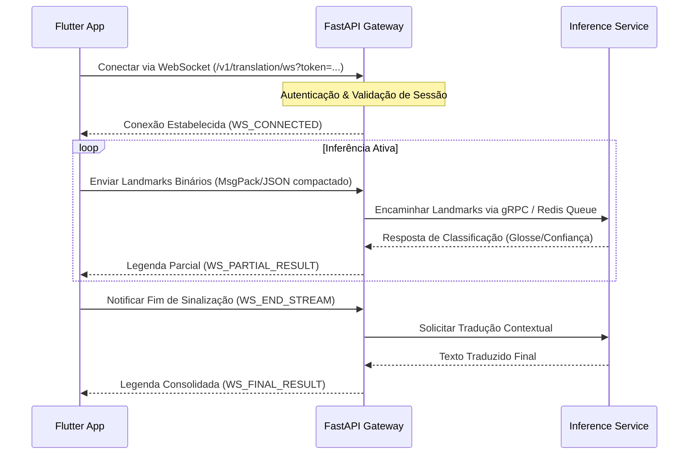
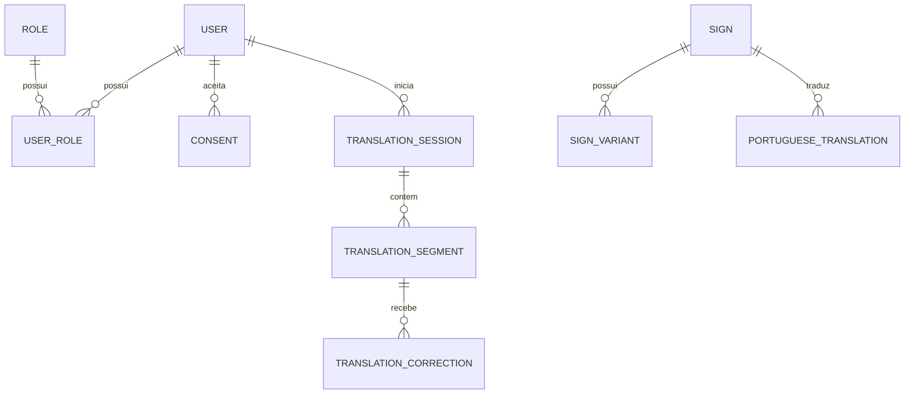

# Architecture and System Design Document - Sinaliza AI

## 1. Organização do Monorepo
Para garantir acoplamento seguro de contratos e alta velocidade de desenvolvimento, utilizamos a seguinte estrutura:

```text
sinaliza-ai/
  apps/
    mobile/                 # Flutter Application (Android/iOS/Web)
    admin-web/              # Next.js 14 Admin Panel
    api-gateway/            # FastAPI Gateway (REST/WebSockets)
    inference-service/      # Python Microservice (Inference & Frame Processing)
  packages/
    api-contracts/          # OpenAPI 3.0 e JSON Schemas de mensagens
    shared-types/           # Tipos Pydantic compartilhados
  ml/
    models/                 # Model Registry metadata e assinaturas
  infrastructure/
    docker/                 # Docker Compose local
    terraform/              # IaC (infraestrutura AWS/GCP genérica)
```

---

## 2. Tecnologias Utilizadas e Justificativa

### 2.1. Aplicativo Móvel (Flutter & Dart)
- **Justificativa**: Código único para Android, iOS e Web. Desempenho excelente graças ao compilador nativo AOT e suporte robusto a isolates (multithreading).
- **Gerenciamento de Estado**: **Riverpod** pela testabilidade e ausência de acoplamento com a árvore de widgets.
- **Banco de Dados Local**: **Drift** (SQLite reativo criptografado) para armazenamento seguro de históricos e cache de glosses offline.

### 2.2. Painel Administrativo (Next.js & TypeScript)
- **Justificativa**: React Server Components (RSC) para renderização segura do lado do servidor (SSR) e controle rígido de autorização nas rotas antes de expor dados do frontend.
- **Validação de Formulários**: Zod + React Hook Form para validação estrita.

### 2.3. Backend (FastAPI & Python 3.11)
- **Justificativa**: Alta performance com programação assíncrona (`asyncio`), auto-geração de documentação OpenAPI/Swagger interativa e forte integração com ecossistema de dados e Machine Learning.
- **ORM**: SQLAlchemy 2.0 (assíncrono) + Alembic para controle de migrations.

---

## 3. Fluxo de Comunicação e Protocolo de Vídeo
O envio contínuo de frames de vídeo via HTTP REST tradicional possui sobrecarga de cabeçalho inaceitável para tempo real. Portanto, a comunicação de inferência ao vivo segue um fluxo híbrido:



---

## 4. Pipeline de Inferência Híbrido (Local vs. Nuvem)

O pipeline opera sob o princípio de processamento local preferencial:

1. **Local (Offline/Básico)**:
   - Captura de Câmera -> MediaPipe local -> Landmarks -> Modelo Local (TFLite/ONNX) -> Tradução de Frases Essenciais e Letras.
2. **Nuvem (Online/Avançado)**:
   - Caso o sinal exija decodificação contextual avançada (Seq2Seq pesado), o aplicativo envia apenas os **Landmarks normalizados** (arquivos leves contendo as coordenadas X, Y, Z dos dedos, rosto e corpo), preservando a privacidade física do rosto da pessoa no vídeo original.

---

## 5. Estrutura de Banco de Dados

### Entidades Mapeadas no SQLAlchemy:



- **Mecanismo de Auditoria**: Todas as alterações críticas nas tabelas de modelos e permissões de usuários geram registros na tabela `audit_logs` que são imutáveis (sem endpoints de alteração ou exclusão).
