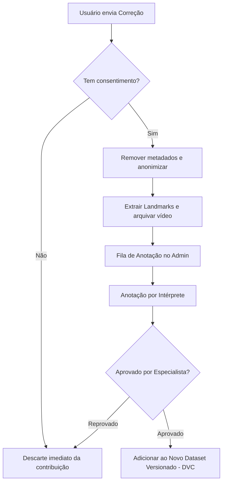

# Dataset Governance and Curation - Sinaliza AI

## 1. Princípios de Coleta e Licenciamento de Dados
Para o retreinamento dos modelos do **Sinaliza AI**, qualquer conjunto de dados utilizado deve obedecer a regras estritas de governança:
- **Origem e Consentimento**: Cada gravação de sinal deve vir de fontes de domínio público, licenciadas comercialmente ou por participantes que assinaram um Termo de Consentimento Livre e Esclarecido (TCLE) com validade jurídica no Brasil.
- **Não Vazamento de Dados Pessoais**: Metadados que revelem nomes, localizações precisas ou outras informações pessoais sensíveis dos sinalizadores serão desvinculados do arquivo de landmarks de treino.

---

## 2. Separação de Dados por Participante (Prevenção de Vazamento de Identidade)

> [!IMPORTANT]
> **REGRA DE VALIDAÇÃO CRÍTICA**: Nunca divida aleatoriamente vídeos de um mesmo participante entre o conjunto de treinamento (train) e validação/teste (val/test).
- Se o participante **A** gravou 50 variações do sinal "Emergência", todos os seus vídeos devem ficar exclusivamente em um único grupo (ou tudo no treino, ou tudo no teste).
- **Justificativa**: A divisão aleatória por vídeo causa vazamento de características físicas (anatomia da mão, tom de pele, fundo da sala do participante) para o modelo. Isso resulta em métricas de precisão infladas artificialmente em laboratório, mas que falham drasticamente quando o app é usado por pessoas reais não vistas anteriormente.

---

## 3. Estrutura de Anotação Multicamada
Os dados do dataset de Libras devem ser indexados em um arquivo JSON/DVC contendo as seguintes camadas de anotação linguística:

```json
{
  "sample_id": "sample_102837",
  "participant_id": "p_082",
  "temporal_segments": {
    "start_frame": 12,
    "end_frame": 48
  },
  "linguistic_data": {
    "gloss": "SAÚDE",
    "translation_portuguese": "Saúde",
    "regional_variation": "SP-Capital",
    "dominant_hand": "Right"
  },
  "non_manual_markers": {
    "facial_expression": "Neutral",
    "body_movement": "Slight forward lean"
  },
  "metadata": {
    "skin_tone_scale": "Fitzpatrick III",
    "illumination_lux": 350,
    "occlusion_detected": false
  },
  "quality_control": {
    "annotator_1_id": "ann_012",
    "annotator_2_id": "ann_005",
    "expert_reviewer_id": "exp_002",
    "status": "APPROVED"
  }
}
```

---

## 4. Pipeline de Contribuição de Usuários
O retreinamento a partir das correções voluntárias de usuários segue o fluxo abaixo para garantir a qualidade dos dados:


- **Dupla Revisão**: Nenhuma amostra entra no dataset de treinamento final sem ter sido avaliada por pelo menos um anotador e validada por um especialista em Libras (surdo nativo ou intérprete certificado).
- **Versionamento com DVC (Data Version Control)**: Os conjuntos de dados de treino e as suas correspondentes anotações de landmarks serão salvos em um Bucket S3 criptografado e versionados via DVC, impedindo arquivos binários grandes no Git.
